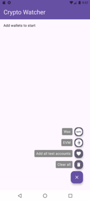
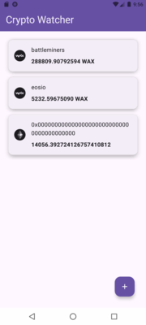

# Crypto Watcher

This is a small Android app demonstrating modern development practices and technologies.

It allows adding a crypto wallet address (currently on Wax and ETH chains) and will retrieve the current balance of the main currency on that chain.  Any number of wallets from supported chains can be added, and wallets can be removed individually.

As this is a demonstration project, it includes FAB actions to add and remove test data for easier testing.

## Features

- **Clean Architecture**: Separation of data access, business logic, and UI layers.
- **UI**: Built with Material 3 and Jetpack Compose.
- **Dependency Injection**: Uses Hilt for simplified DI and better modularity.
- **Data Sources**: Integrates Web3j and Retrofit 2 for external data, and DataStore for local preferences.
- **Testing**: Includes tests using Espresso and JUnit, with assertions powered by Google Truth.
- **Build**: Kotlin build structure

While only Wax and ETH wallets are enabled here, the infrastructure supports any number of crypto networks and adding different EVM chains using the same Web3j integration would be a trivial addition.

### Screenshots
    

### Dependency Injection (DI) Notes

While using Hilt for a small app may seem like overengineering due to the additional annotations and classes, it helps by reducing the need to pass context through various layers. This implementation serves as a practical example of DI in Android development.

## Setup Instructions

1. Obtain a free [Infura](https://www.infura.io/) Project ID.
2. Add the following line to your `local.properties` file:
   ```properties
   infuraProjectId = "<your Infura key>"
   ```
3. Deploy to an Android emulator or device running Android 8 or higher.


## Limitations

- **Android Version**: Due to stricter SSL certificate handling on Android 7, the minimum supported version for this app is Android 8 (API level 26).

## Testing Status

Unit tests are currently incomplete and may receive updates in future iterations.

## Acknowledgments

Some icons are sourced from [Iconduck Cryptocurrency Icons](https://iconduck.com/sets/cryptocurrency-icons), licensed under the Creative Commons Zero v1.0 Universal license.

## License

Copyright (C) 2025 Tim Mackenzie

Licensed under the Apache License, Version 2.0 (the "License");
you may not use files in this project except in compliance with the License.
You may obtain a copy of the License at

       http://www.apache.org/licenses/LICENSE-2.0

Unless required by applicable law or agreed to in writing, software
distributed under the License is distributed on an "AS IS" BASIS,
WITHOUT WARRANTIES OR CONDITIONS OF ANY KIND, either express or implied.
See the License for the specific language governing permissions and
limitations under the License.